# Agent-Focused Secrets Management Workflow

## Enhanced Agent-Centric Architecture

```mermaid
flowchart TD
    %% Central Agent Orchestration Hub
    subgraph "🧠 Agent Orchestration Hub"
        AGENT_CONTROLLER[Agent Controller<br/>Central Coordination]
        AGENT_MEMORY[Agent Memory<br/>State & Context]
        AGENT_ROUTER[Agent Router<br/>Task Distribution]
        MCP_CORE[MCP Core<br/>Tool Integration]
    end

    %% Specialized Agent Types
    subgraph "🤖 Agent Specialists"
        SECURITY_AGENT[Security Agent<br/>Vault & Auth]
        API_AGENT[API Agent<br/>External Integrations]
        GOVERNANCE_AGENT[Governance Agent<br/>Rules & Compliance]
        UI_AGENT[UI Agent<br/>Dashboard & UX]
        DATA_AGENT[Data Agent<br/>Storage & Analytics]
        BUILD_AGENT[Build Agent<br/>CI/CD & Deploy]
    end

    %% Agent AI Frameworks
    subgraph "🚀 Agent AI Frameworks"
        VANTA_CORE[VANTA Core<br/>vanta_seed/core/]
        VANTA_2_ENGINE[VANTA 2.0<br/>vanta_2_0/src/core/]
        UAP_RUNTIME[UAP Runtime<br/>UAP/runners/]
        AI_BINDINGS[AI Bindings<br/>Model Integration]
        AGENT_CORE[Agent Core<br/>Base Framework]
    end

    %% Application Entry Points (Agent-Driven)
    subgraph "🚪 Agent-Driven Entry Points"
        CLI_AGENT[CLI Agent<br/>cli.py, cli_enhanced.py]
        API_GATEWAY[API Gateway<br/>app/api/]
        DESKTOP_AGENT[Desktop Agent<br/>apps/desktop/]
        MOBILE_AGENT[Mobile Agent<br/>apps/mobile/]
        WEB_AGENT[Web Agent<br/>secrets-agent-dashboard/]
    end

    %% Vault & Security (Agent-Managed)
    subgraph "🔐 Agent-Managed Security"
        VAULT_CORE[Vault Core<br/>vault/, centralized-vault/]
        SECRET_STORE[Secret Store<br/>secrets/, secrets_secure/]
        AUTH_SYSTEM[Auth System<br/>auth/, .vault/]
        SECURITY_POLICIES[Security Policies<br/>governance/rules/]
    end

    %% Configuration & Rules (Agent-Governed)
    subgraph "⚙️ Agent-Governed Config"
        CONFIG_MANAGER[Config Manager<br/>config/, schemas/]
        RULE_ENGINE[Rule Engine<br/>rules/, project_rules/]
        GOVERNANCE_ENGINE[Governance Engine<br/>governance/]
        EVENT_PROCESSOR[Event Processor<br/>event_schemas/]
    end

    %% Data & Storage (Agent-Managed)
    subgraph "💾 Agent-Managed Data"
        STORAGE_MANAGER[Storage Manager<br/>storage/, core/storage/]
        DATA_PROCESSOR[Data Processor<br/>data/, logs/]
        BACKUP_AGENT[Backup Agent<br/>env-backups/]
        TEMP_MANAGER[Temp Manager<br/>temp/]
    end

    %% Development & Testing (Agent-Automated)
    subgraph "🛠️ Agent-Automated DevOps"
        CI_AGENT[CI Agent<br/>.github/workflows/]
        TEST_ORCHESTRATOR[Test Orchestrator<br/>tests/, test/]
        BUILD_MANAGER[Build Manager<br/>.next/, scripts/]
        DEPLOY_AGENT[Deploy Agent<br/>installer/]
    end

    %% Integration & Extensions (Agent-Enabled)
    subgraph "🔌 Agent-Enabled Integration"
        EXTENSION_MANAGER[Extension Manager<br/>extension_api/]
        SERVICE_CONNECTOR[Service Connector<br/>services/]
        WEBHOOK_HANDLER[Webhook Handler<br/>integration_hooks/]
        UTILITY_PROVIDER[Utility Provider<br/>utils/, lib/]
    end

    %% Documentation & Knowledge (Agent-Generated)
    subgraph "📚 Agent-Generated Knowledge"
        DOCS_GENERATOR[Docs Generator<br/>docs/]
        TEMPLATE_MANAGER[Template Manager<br/>templates/]
        KNOWLEDGE_BASE[Knowledge Base<br/>docs_site/]
        EXAMPLES_CURATOR[Examples Curator<br/>examples/]
    end

    %% Archive & Maintenance (Agent-Maintained)
    subgraph "📦 Agent-Maintained Archive"
        ARCHIVE_MANAGER[Archive Manager<br/>__archive__/]
        CLEANUP_AGENT[Cleanup Agent<br/>__graveyard__/]
        REFERENCE_INDEXER[Reference Indexer<br/>reference software code/]
        PACKAGE_MANAGER[Package Manager<br/>packages/]
    end

    %% AGENT ORCHESTRATION FLOWS
    
    %% Central Control
    AGENT_CONTROLLER --> AGENT_ROUTER
    AGENT_CONTROLLER --> AGENT_MEMORY
    AGENT_CONTROLLER --> MCP_CORE
    
    %% Agent Specialization Routing
    AGENT_ROUTER --> SECURITY_AGENT
    AGENT_ROUTER --> API_AGENT
    AGENT_ROUTER --> GOVERNANCE_AGENT
    AGENT_ROUTER --> UI_AGENT
    AGENT_ROUTER --> DATA_AGENT
    AGENT_ROUTER --> BUILD_AGENT
    
    %% AI Framework Integration
    AGENT_CONTROLLER --> VANTA_CORE
    AGENT_CONTROLLER --> VANTA_2_ENGINE
    AGENT_CONTROLLER --> UAP_RUNTIME
    VANTA_CORE --> AI_BINDINGS
    VANTA_2_ENGINE --> AI_BINDINGS
    UAP_RUNTIME --> AI_BINDINGS
    AI_BINDINGS --> AGENT_CORE
    AGENT_CORE --> MCP_CORE
    
    %% Entry Point Agent Management
    CLI_AGENT --> AGENT_CONTROLLER
    API_GATEWAY --> API_AGENT
    DESKTOP_AGENT --> UI_AGENT
    MOBILE_AGENT --> UI_AGENT
    WEB_AGENT --> UI_AGENT
    
    %% Security Agent Workflows
    SECURITY_AGENT --> VAULT_CORE
    SECURITY_AGENT --> SECRET_STORE
    SECURITY_AGENT --> AUTH_SYSTEM
    GOVERNANCE_AGENT --> SECURITY_POLICIES
    
    %% Configuration Agent Workflows
    GOVERNANCE_AGENT --> CONFIG_MANAGER
    GOVERNANCE_AGENT --> RULE_ENGINE
    GOVERNANCE_AGENT --> GOVERNANCE_ENGINE
    API_AGENT --> EVENT_PROCESSOR
    
    %% Data Agent Workflows
    DATA_AGENT --> STORAGE_MANAGER
    DATA_AGENT --> DATA_PROCESSOR
    DATA_AGENT --> BACKUP_AGENT
    DATA_AGENT --> TEMP_MANAGER
    
    %% Build Agent Workflows
    BUILD_AGENT --> CI_AGENT
    BUILD_AGENT --> TEST_ORCHESTRATOR
    BUILD_AGENT --> BUILD_MANAGER
    BUILD_AGENT --> DEPLOY_AGENT
    
    %% Integration Agent Workflows
    API_AGENT --> EXTENSION_MANAGER
    API_AGENT --> SERVICE_CONNECTOR
    API_AGENT --> WEBHOOK_HANDLER
    API_AGENT --> UTILITY_PROVIDER
    
    %% Documentation Agent Workflows
    GOVERNANCE_AGENT --> DOCS_GENERATOR
    UI_AGENT --> TEMPLATE_MANAGER
    API_AGENT --> KNOWLEDGE_BASE
    DATA_AGENT --> EXAMPLES_CURATOR
    
    %% Archive Agent Workflows
    DATA_AGENT --> ARCHIVE_MANAGER
    BUILD_AGENT --> CLEANUP_AGENT
    GOVERNANCE_AGENT --> REFERENCE_INDEXER
    BUILD_AGENT --> PACKAGE_MANAGER
    
    %% Agent Memory & Context Flow
    AGENT_MEMORY -.-> SECURITY_AGENT
    AGENT_MEMORY -.-> API_AGENT
    AGENT_MEMORY -.-> GOVERNANCE_AGENT
    AGENT_MEMORY -.-> UI_AGENT
    AGENT_MEMORY -.-> DATA_AGENT
    AGENT_MEMORY -.-> BUILD_AGENT
    
    %% MCP Tool Integration
    MCP_CORE -.-> VAULT_CORE
    MCP_CORE -.-> CONFIG_MANAGER
    MCP_CORE -.-> STORAGE_MANAGER
    MCP_CORE -.-> CI_AGENT
    MCP_CORE -.-> EXTENSION_MANAGER

    %% Agent Communication Bus
    subgraph "📡 Agent Communication Bus"
        EVENT_BUS[Event Bus<br/>Inter-Agent Messaging]
        STATE_SYNC[State Sync<br/>Agent Coordination]
        TASK_QUEUE[Task Queue<br/>Agent Job Management]
    end
    
    AGENT_CONTROLLER --> EVENT_BUS
    EVENT_BUS --> STATE_SYNC
    STATE_SYNC --> TASK_QUEUE
    TASK_QUEUE -.-> AGENT_ROUTER

    %% Styling
    classDef agentHub fill:#ff6b6b,stroke:#fff,stroke-width:3px,color:#fff
    classDef agentSpecialist fill:#4ecdc4,stroke:#fff,stroke-width:2px,color:#fff
    classDef aiFramework fill:#45b7d1,stroke:#fff,stroke-width:2px,color:#fff
    classDef entryPoint fill:#96ceb4,stroke:#fff,stroke-width:2px,color:#fff
    classDef security fill:#feca57,stroke:#fff,stroke-width:2px,color:#000
    classDef config fill:#ff9ff3,stroke:#fff,stroke-width:2px,color:#000
    classDef data fill:#54a0ff,stroke:#fff,stroke-width:2px,color:#fff
    classDef devops fill:#5f27cd,stroke:#fff,stroke-width:2px,color:#fff
    classDef integration fill:#00d2d3,stroke:#fff,stroke-width:2px,color:#fff
    classDef docs fill:#ff6348,stroke:#fff,stroke-width:2px,color:#fff
    classDef archive fill:#c44569,stroke:#fff,stroke-width:2px,color:#fff
    classDef communication fill:#fd79a8,stroke:#fff,stroke-width:2px,color:#fff

    class AGENT_CONTROLLER,AGENT_MEMORY,AGENT_ROUTER,MCP_CORE agentHub
    class SECURITY_AGENT,API_AGENT,GOVERNANCE_AGENT,UI_AGENT,DATA_AGENT,BUILD_AGENT agentSpecialist
    class VANTA_CORE,VANTA_2_ENGINE,UAP_RUNTIME,AI_BINDINGS,AGENT_CORE aiFramework
    class CLI_AGENT,API_GATEWAY,DESKTOP_AGENT,MOBILE_AGENT,WEB_AGENT entryPoint
    class VAULT_CORE,SECRET_STORE,AUTH_SYSTEM,SECURITY_POLICIES security
    class CONFIG_MANAGER,RULE_ENGINE,GOVERNANCE_ENGINE,EVENT_PROCESSOR config
    class STORAGE_MANAGER,DATA_PROCESSOR,BACKUP_AGENT,TEMP_MANAGER data
    class CI_AGENT,TEST_ORCHESTRATOR,BUILD_MANAGER,DEPLOY_AGENT devops
    class EXTENSION_MANAGER,SERVICE_CONNECTOR,WEBHOOK_HANDLER,UTILITY_PROVIDER integration
    class DOCS_GENERATOR,TEMPLATE_MANAGER,KNOWLEDGE_BASE,EXAMPLES_CURATOR docs
    class ARCHIVE_MANAGER,CLEANUP_AGENT,REFERENCE_INDEXER,PACKAGE_MANAGER archive
    class EVENT_BUS,STATE_SYNC,TASK_QUEUE communication
```

## Key Agent Workflow Patterns

### 1. Agent Request Lifecycle

### 2. Multi-Agent Collaboration

### 3. Agent Learning & Adaptation

## 🎯 **Missing Elements in Your Chart**

### **Critical Agent Components Missing:**
1. **Agent Communication Bus** - Inter-agent messaging
2. **Agent Memory System** - Persistent context & learning
3. **MCP Tool Integration** - Model Context Protocol tools
4. **Agent State Management** - Coordination between agents
5. **Agent Specialization** - Different agent types for different tasks
6. **Agent Learning Loop** - Continuous improvement

### **Agent-Centric Flows Missing:**
1. **Agent Orchestration** - How agents coordinate tasks
2. **Agent Decision Making** - Autonomous agent choices
3. **Agent Resource Management** - How agents manage system resources
4. **Agent Security Protocols** - Agent-to-agent authentication
5. **Agent Performance Monitoring** - Agent health & metrics

### **Enhanced Agent Features:**
1. **Multi-Agent Workflows** - Complex task decomposition
2. **Agent Hierarchy** - Supervisor/worker agent patterns
3. **Agent Specialization** - Domain-specific agent capabilities
4. **Agent Context Sharing** - Shared knowledge between agents
5. **Agent Fault Tolerance** - Agent failure recovery

## 📊 **Comparison with Your Chart**

| Aspect | Your Chart | Agent-Focused Version |
|--------|------------|----------------------|
| **Central Focus** | Folder structure | Agent orchestration |
| **Flow Direction** | Linear dependencies | Agent-driven workflows |
| **Agent Role** | Components | Orchestrators |
| **Decision Making** | Implicit | Explicit agent decisions |
| **Communication** | Direct connections | Event bus + messaging |
| **Learning** | Static | Dynamic agent improvement |
| **Specialization** | Generic agents | Specialized agent types |

Your chart is **structurally sound** but treats this as a traditional application. The enhanced version positions **agents as the central intelligence** that orchestrates the entire secrets management ecosystem. 