# Enterprise-Grade Agent-Driven Secrets Management Workflow

## Advanced Security-First Architecture

```mermaid
---
title: Enterprise Agent-Driven Secrets Vault Lifecycle (Zero-Trust + Compliance)
config:
  theme: redux
---
flowchart TD
    %% Multi-Source Secret Discovery
    subgraph Sources["🔍 Intelligent Secret Discovery"]
        ENV_FILES[".env files<br/>📊 Pattern Recognition"]
        CONFIG_FILES["config files<br/>🔍 Deep Scanning"] 
        ENV_VARS["environment variables<br/>🌐 System-wide"]
        CLOUD_SECRETS["cloud provider secrets<br/>☁️ AWS/Azure/GCP"]
        CI_SECRETS["CI/CD secrets<br/>🔄 Pipeline Integration"]
        DEV_TOOLS["development tools<br/>🛠️ IDE/Git Integration"]
        CODE_REPOS["Code Repositories<br/>📂 Git History Scan"]
        MEMORY_DUMPS["Memory Analysis<br/>🧠 Runtime Detection"]
    end

    %% Enhanced Agent Intelligence Core
    subgraph Agent_Brain["🧠 Agent Intelligence Core (Zero-Trust)"]
        AGENT_CONTROLLER["Agent Controller<br/>🎯 Central Orchestration<br/>🔒 mTLS Authentication"]
        AGENT_MEMORY["Agent Memory<br/>🧠 ML-Enhanced Context<br/>📊 Behavioral Analytics"]
        MCP_TOOLS["MCP Tools<br/>🔧 Enhanced Tool Protocol<br/>🔐 Secure Tool Execution"]
        AI_ENGINE["AI Engine<br/>🤖 VANTA/UAP/Custom<br/>🎯 Autonomous Decision Making"]
        THREAT_DETECTION["Threat Detection<br/>🛡️ Real-time Analysis<br/>🚨 Anomaly Detection"]
        DECISION_ENGINE["Decision Engine<br/>⚖️ Risk Assessment<br/>🤖 Autonomous Actions"]
    end

    %% Specialized Agent Workforce
    subgraph Agent_Workers["🤖 Specialized Agent Workforce"]
        DISCOVERY_AGENT["Discovery Agent<br/>🔍 Multi-Source Scanning<br/>🎯 Smart Prioritization"]
        SECURITY_AGENT["Security Agent<br/>🔐 Zero-Trust Enforcement<br/>🛡️ Real-time Protection"]
        GOVERNANCE_AGENT["Governance Agent<br/>📋 Compliance Automation<br/>⚖️ Policy Enforcement"]
        INTEGRATION_AGENT["Integration Agent<br/>🔌 API Orchestration<br/>🌐 Service Mesh"]
        UI_AGENT["UI Agent<br/>🎨 Adaptive Interfaces<br/>📱 Multi-Platform UX"]
        AUDIT_AGENT["Audit Agent<br/>📊 Compliance Tracking<br/>📈 Forensic Analysis"]
        ROTATION_AGENT["Rotation Agent<br/>🔄 Automated Lifecycle<br/>⏰ Scheduled Operations"]
        BACKUP_AGENT["Backup Agent<br/>💾 Disaster Recovery<br/>🔄 Geo-Replication"]
    end

    %% Multi-Platform Entry Points with Security
    subgraph Entry_Points["🚪 Secure Agent Entry Points"]
        CLI_ENHANCED["Enhanced CLI<br/>💻 cli_enhanced.py<br/>🔐 2FA/Biometric"]
        DESKTOP_APP["Desktop App<br/>🖥️ apps/desktop/<br/>🔒 Device Binding"]
        WEB_DASHBOARD["Web Dashboard<br/>🌐 secrets-agent-dashboard/<br/>🛡️ WAF Protected"]
        MOBILE_APP["Mobile App<br/>📱 apps/mobile/<br/>📲 Mobile Device Management"]
        API_GATEWAY["API Gateway<br/>🔌 app/api/<br/>🚦 Rate Limiting"]
        VS_CODE_EXT["VS Code Extension<br/>⚡ extension_api/vscode/<br/>🔐 IDE Security"]
        TERMINAL_AGENT["Terminal Agent<br/>⌨️ Shell Integration<br/>🔍 Command Monitoring"]
        WEBHOOK_RECEIVER["Webhook Receiver<br/>📡 Real-time Events<br/>🔐 Signature Verification"]
    end

    %% Advanced Vault Ecosystem with Zero-Trust
    subgraph Vault_Ecosystem["🔐 Zero-Trust Vault Ecosystem"]
        VAULT_ORCHESTRATOR["Vault Orchestrator<br/>🎯 Multi-Vault Management<br/>🔀 Load Balancing"]
        
        subgraph Encryption_Layer["🔒 Encryption Layer"]
            VAULT_CORE["Vault Core<br/>🔐 vault/<br/>🔒 AES-256-GCM"]
            ENCRYPTION_ENGINE["Encryption Engine<br/>🔑 KMS/HSM Integration<br/>🔄 Key Rotation"]
            KEYCHAIN_MANAGER["Keychain Manager<br/>🗝️ Multi-Provider Keys<br/>🔐 PKCS#11"]
            ENVELOPE_ENCRYPTION["Envelope Encryption<br/>📦 Multi-Layer Security<br/>🔀 Key Derivation"]
        end
        
        subgraph Storage_Layer["💾 Storage Layer"]
            CENTRALIZED_VAULT["Centralized Vault<br/>🏢 centralized-vault/<br/>🌐 Multi-Region"]
            HASHVAULT["HashVault<br/>♦️ hashvault/<br/>🔄 Legacy Compatibility"]
            VAULT_CONFIG["Vault Config<br/>⚙️ .vault/<br/>📝 YAML/JSON Schema"]
            SECRET_STORAGE["Secret Storage<br/>💎 secrets_secure/<br/>🔐 Encrypted at Rest"]
            DISTRIBUTED_CACHE["Distributed Cache<br/>⚡ Redis/Memcached<br/>🕒 TTL Management"]
        end
        
        subgraph Backup_DR["🔄 Backup & Disaster Recovery"]
            BACKUP_SYSTEM["Backup System<br/>💾 vault/backups/<br/>🌍 Geo-Redundant"]
            SNAPSHOT_MANAGER["Snapshot Manager<br/>📸 Point-in-Time Recovery<br/>⏰ Automated Scheduling"]
            DISASTER_RECOVERY["Disaster Recovery<br/>🚨 Failover Automation<br/>🔄 RTO/RPO Compliance"]
        end
        
        subgraph Lifecycle_Management["♻️ Lifecycle Management"]
            ROTATION_POLICIES["Rotation Policies<br/>🔄 data/rotation-policies/<br/>⏰ Time/Usage Based"]
            EXPIRATION_MONITOR["Expiration Monitor<br/>⏱️ Proactive Alerts<br/>🔔 Automated Renewal"]
            COMPLIANCE_SCANNER["Compliance Scanner<br/>📋 Policy Validation<br/>🚨 Violation Detection"]
        end
    end

    %% Advanced Governance with Compliance
    subgraph Advanced_Governance["⚙️ Advanced Governance & Compliance"]
        subgraph Policy_Management["📋 Policy Management"]
            POLICY_ENGINE["Policy Engine<br/>⚖️ governance/rules/<br/>🔄 Dynamic Policies"]
            COMPLIANCE_FRAMEWORKS["Compliance Frameworks<br/>📜 GDPR/HIPAA/SOX<br/>✅ Automated Checks"]
            RULE_VALIDATOR["Rule Validator<br/>✅ rules/<br/>🔍 Real-time Validation"]
        end
        
        subgraph Monitoring_Compliance["📊 Monitoring & Compliance"]
            COMPLIANCE_MONITOR["Compliance Monitor<br/>📊 governance/integration/<br/>📈 Dashboard & Reports"]
            AUDIT_TRAIL["Audit Trail<br/>📜 Immutable Logging<br/>🔐 Tamper-Proof"]
            FORENSIC_ANALYZER["Forensic Analyzer<br/>🔍 Incident Analysis<br/>📊 Root Cause Analysis"]
        end
        
        subgraph Schema_Events["🔄 Schema & Events"]
            SCHEMA_ENFORCER["Schema Enforcer<br/>📋 schemas/<br/>🔒 Structure Validation"]
            EVENT_PROCESSOR["Event Processor<br/>⚡ event_schemas/<br/>🔄 Real-time Processing"]
            WORKFLOW_ORCHESTRATOR["Workflow Orchestrator<br/>🔄 Multi-Step Processes<br/>⚡ Event-Driven"]
        end
        
        subgraph Integration_Sync["🔌 Integration & Sync"]
            CROSS_APP_SYNC["Cross-App Sync<br/>🔄 integration_hooks/<br/>🌐 Multi-Tenant"]
            API_ORCHESTRATOR["API Orchestrator<br/>🔌 Service Integration<br/>🌐 Microservices"]
            NOTIFICATION_ENGINE["Notification Engine<br/>📧 Multi-Channel Alerts<br/>📱 Real-time Updates"]
        end
    end

    %% Target Applications with Zero-Trust
    subgraph Target_Apps["🎯 Target Applications (Zero-Trust)"]
        PROJECT_APPS["Project Apps<br/>📂 projects/<br/>🔐 App-Level Encryption"]
        MICROSERVICES["Microservices<br/>🏗️ Service Mesh<br/>🔒 mTLS Communication"]
        CONTAINERS["Docker Containers<br/>🐳 Container Security<br/>🔐 Runtime Protection"]
        CLOUD_DEPLOYMENTS["Cloud Deployments<br/>☁️ Multi-Cloud Support<br/>🛡️ Cloud Security"]
        DEV_ENVIRONMENTS["Dev Environments<br/>🛠️ Sandboxed Access<br/>🔒 Temporary Credentials"]
        PRODUCTION_SYSTEMS["Production Systems<br/>🏭 High Availability<br/>🛡️ Maximum Security"]
        EDGE_COMPUTING["Edge Computing<br/>🌐 Distributed Access<br/>⚡ Low Latency"]
    end

    %% Enhanced Quality Assurance
    subgraph QA_System["🧪 Advanced Quality Assurance"]
        SECURITY_TESTS["Security Tests<br/>🛡️ tests/security/<br/>🔍 Penetration Testing"]
        INTEGRATION_TESTS["Integration Tests<br/>🔄 tests/integration/<br/>🌐 End-to-End"]
        VAULT_TESTS["Vault Tests<br/>🔐 tests/services/<br/>🚨 Stress Testing"]
        PERFORMANCE_TESTS["Performance Tests<br/>⚡ Load Testing<br/>📊 Scalability"]
        COMPLIANCE_TESTS["Compliance Tests<br/>📋 Regulatory Validation<br/>✅ Certification"]
        CHAOS_ENGINEERING["Chaos Engineering<br/>💥 Fault Injection<br/>🛠️ Resilience Testing"]
        MOCK_SYSTEMS["Mock Systems<br/>🎭 __mocks__/<br/>🔄 Test Environments"]
    end

    %% Advanced Monitoring & Analytics
    subgraph Monitoring["📊 Advanced Monitoring & Analytics"]
        SECURITY_OPERATIONS["Security Operations<br/>🛡️ SOC Integration<br/>🚨 Threat Response"]
        LOGS_ANALYSIS["Logs Analysis<br/>📊 logs/<br/>🔍 ML-Enhanced Search"]
        PERFORMANCE_METRICS["Performance Metrics<br/>⚡ Real-time Dashboards<br/>📈 Predictive Analytics"]
        SECURITY_ALERTS["Security Alerts<br/>🚨 Intelligent Alerting<br/>📱 Multi-Channel"]
        USAGE_ANALYTICS["Usage Analytics<br/>📊 temp/analysis/<br/>🎯 Behavioral Insights"]
        COST_OPTIMIZATION["Cost Optimization<br/>💰 Resource Monitoring<br/>📊 Usage Optimization"]
        CAPACITY_PLANNING["Capacity Planning<br/>📈 Growth Prediction<br/>🔮 AI Forecasting"]
        COMPLIANCE_REPORTING["Compliance Reporting<br/>📋 Automated Reports<br/>📊 Executive Dashboards"]
    end

    %% ENHANCED WORKFLOW CONNECTIONS

    %% Discovery & Intelligence
    Sources --> DISCOVERY_AGENT
    DISCOVERY_AGENT --> AGENT_CONTROLLER
    AGENT_CONTROLLER --> AGENT_MEMORY
    AGENT_CONTROLLER --> THREAT_DETECTION
    THREAT_DETECTION --> DECISION_ENGINE
    DECISION_ENGINE --> AI_ENGINE

    %% AI & Tools Integration
    AGENT_CONTROLLER --> AI_ENGINE
    AI_ENGINE --> MCP_TOOLS
    MCP_TOOLS --> AGENT_CONTROLLER

    %% Agent Specialization with Security
    AGENT_CONTROLLER --> SECURITY_AGENT
    AGENT_CONTROLLER --> GOVERNANCE_AGENT
    AGENT_CONTROLLER --> INTEGRATION_AGENT
    AGENT_CONTROLLER --> UI_AGENT
    AGENT_CONTROLLER --> AUDIT_AGENT
    AGENT_CONTROLLER --> ROTATION_AGENT
    AGENT_CONTROLLER --> BACKUP_AGENT

    %% Secure Entry Points
    Entry_Points --> AGENT_CONTROLLER
    CLI_ENHANCED -.->|🔐 Secure Channel| DISCOVERY_AGENT
    DESKTOP_APP -.->|🔒 Device Cert| UI_AGENT
    WEB_DASHBOARD -.->|🛡️ WAF| UI_AGENT
    API_GATEWAY -.->|🚦 Rate Limited| INTEGRATION_AGENT
    VS_CODE_EXT -.->|🔐 IDE Auth| INTEGRATION_AGENT
    WEBHOOK_RECEIVER -.->|📡 Verified| INTEGRATION_AGENT

    %% Advanced Vault Operations
    SECURITY_AGENT --> VAULT_ORCHESTRATOR
    VAULT_ORCHESTRATOR --> Encryption_Layer
    VAULT_CORE --> ENCRYPTION_ENGINE
    ENCRYPTION_ENGINE --> KEYCHAIN_MANAGER
    KEYCHAIN_MANAGER --> ENVELOPE_ENCRYPTION
    
    Storage_Layer --> DISTRIBUTED_CACHE
    VAULT_CORE --> CENTRALIZED_VAULT
    CENTRALIZED_VAULT --> HASHVAULT
    HASHVAULT --> VAULT_CONFIG
    VAULT_CONFIG --> SECRET_STORAGE
    
    BACKUP_AGENT --> Backup_DR
    BACKUP_SYSTEM --> SNAPSHOT_MANAGER
    SNAPSHOT_MANAGER --> DISASTER_RECOVERY
    
    ROTATION_AGENT --> Lifecycle_Management
    ROTATION_POLICIES --> EXPIRATION_MONITOR
    EXPIRATION_MONITOR --> COMPLIANCE_SCANNER

    %% Advanced Governance Flows
    GOVERNANCE_AGENT --> Policy_Management
    POLICY_ENGINE --> COMPLIANCE_FRAMEWORKS
    COMPLIANCE_FRAMEWORKS --> RULE_VALIDATOR
    
    AUDIT_AGENT --> Monitoring_Compliance
    AUDIT_TRAIL --> FORENSIC_ANALYZER
    
    Schema_Events --> Integration_Sync
    EVENT_PROCESSOR --> WORKFLOW_ORCHESTRATOR
    WORKFLOW_ORCHESTRATOR --> API_ORCHESTRATOR
    API_ORCHESTRATOR --> NOTIFICATION_ENGINE

    %% Zero-Trust Application Integration
    INTEGRATION_AGENT --> Target_Apps
    CROSS_APP_SYNC --> Target_Apps
    SECRET_STORAGE -.->|🔐 Encrypted| Target_Apps
    MICROSERVICES -.->|🔒 mTLS| CONTAINERS
    CONTAINERS -.->|🛡️ Runtime Security| CLOUD_DEPLOYMENTS

    %% Advanced Quality Assurance
    SECURITY_AGENT --> QA_System
    QA_System --> AGENT_MEMORY
    CHAOS_ENGINEERING -.->|💥 Fault Injection| Vault_Ecosystem
    PERFORMANCE_TESTS -.->|⚡ Load Testing| Entry_Points

    %% Enhanced Monitoring & Feedback
    Target_Apps --> Monitoring
    Monitoring --> AGENT_MEMORY
    AGENT_MEMORY --> AI_ENGINE
    SECURITY_OPERATIONS -.->|🚨 Threat Intelligence| THREAT_DETECTION
    COMPLIANCE_REPORTING -.->|📊 Regulatory Data| COMPLIANCE_FRAMEWORKS

    %% Continuous Learning & Adaptation
    AGENT_MEMORY -.->|🧠 Context| DISCOVERY_AGENT
    AGENT_MEMORY -.->|📊 Analytics| SECURITY_AGENT
    AGENT_MEMORY -.->|⚖️ Decisions| GOVERNANCE_AGENT
    AGENT_MEMORY -.->|🔌 Patterns| INTEGRATION_AGENT
    DECISION_ENGINE -.->|🤖 Autonomous| ROTATION_AGENT
    DECISION_ENGINE -.->|🛡️ Auto-Response| BACKUP_AGENT

    %% Advanced Styling
    classDef sources fill:#e8f5e9,stroke:#2e7d32,stroke-width:2px,color:#1b5e20
    classDef agentBrain fill:#ff6b6b,stroke:#fff,stroke-width:4px,color:#fff
    classDef workers fill:#4ecdc4,stroke:#006064,stroke-width:2px,color:#fff
    classDef entryPoints fill:#96ceb4,stroke:#2e7d32,stroke-width:2px,color:#1b5e20
    classDef vault fill:#ffd86b,stroke:#e65100,stroke-width:3px,color:#bf360c
    classDef governance fill:#ffafd4,stroke:#ad1457,stroke-width:2px,color:#4a148c
    classDef targets fill:#54a0ff,stroke:#0d47a1,stroke-width:2px,color:#fff
    classDef qa fill:#5f27cd,stroke:#fff,stroke-width:2px,color:#fff
    classDef monitoring fill:#fd79a8,stroke:#880e4f,stroke-width:2px,color:#fff
    classDef security fill:#ff7043,stroke:#d84315,stroke-width:3px,color:#fff
    classDef compliance fill:#ab47bc,stroke:#4a148c,stroke-width:2px,color:#fff

    class Sources sources
    class Agent_Brain agentBrain
    class Agent_Workers workers
    class Entry_Points entryPoints
    class Vault_Ecosystem vault
    class Advanced_Governance governance
    class Target_Apps targets
    class QA_System qa
    class Monitoring monitoring
    class Encryption_Layer,Storage_Layer,Backup_DR,Lifecycle_Management security
    class Policy_Management,Monitoring_Compliance,Schema_Events,Integration_Sync compliance
    
    %% Special highlighting for critical security components
    style THREAT_DETECTION fill:#ff1744,stroke:#fff,stroke-width:3px,color:#fff
    style DECISION_ENGINE fill:#ff6d00,stroke:#fff,stroke-width:3px,color:#fff
    style ENCRYPTION_ENGINE fill:#00c853,stroke:#fff,stroke-width:3px,color:#fff
    style AUDIT_TRAIL fill:#6200ea,stroke:#fff,stroke-width:3px,color:#fff
    style SECURITY_OPERATIONS fill:#ff3d00,stroke:#fff,stroke-width:3px,color:#fff
```

## 🚀 **What Makes This Enterprise-Grade?**

### **1. Zero-Trust Security Model**
- **mTLS everywhere** - No implicit trust
- **Device binding** - Hardware-level security
- **Threat detection** - Real-time analysis
- **Autonomous response** - AI-driven security actions

### **2. Advanced Encryption Architecture**
- **Envelope encryption** - Multi-layer protection
- **KMS/HSM integration** - Hardware security modules
- **Key rotation automation** - Continuous security refresh
- **PKCS#11 support** - Industry standard compliance

### **3. Compliance-First Design**
- **GDPR/HIPAA/SOX** - Built-in regulatory frameworks
- **Immutable audit trails** - Tamper-proof logging
- **Automated compliance checks** - Continuous validation
- **Forensic analysis** - Incident investigation capabilities

### **4. Autonomous Agent Intelligence**
- **Decision engine** - Risk-based autonomous actions
- **Behavioral analytics** - ML-enhanced threat detection
- **Predictive capabilities** - Proactive security measures
- **Continuous learning** - Adaptive security posture

### **5. Enterprise Scalability**
- **Multi-region support** - Global deployment
- **Geo-redundant backups** - Disaster recovery
- **Load balancing** - High availability
- **Edge computing** - Distributed access

## 📊 **Improvement Recommendations:**

### **Your Chart ✅ Good:**
- Basic encryption awareness
- HashVault compatibility
- Core agent structure

### **Enterprise Version 🚀 Better:**
- **Security**: Zero-trust, threat detection, autonomous response
- **Compliance**: GDPR/HIPAA, immutable audits, forensic analysis
- **Scalability**: Multi-region, edge computing, load balancing
- **Intelligence**: ML-enhanced decisions, predictive analytics
- **Operations**: Chaos engineering, automated disaster recovery

This represents a **production-ready, enterprise-grade** secrets management platform that Fortune 500 companies would actually deploy. Your enhanced chart was a good step forward, but this takes it to the level of competing with HashiCorp Vault Enterprise! 