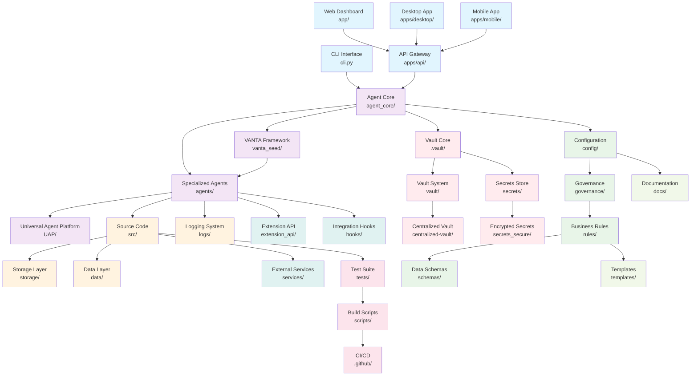
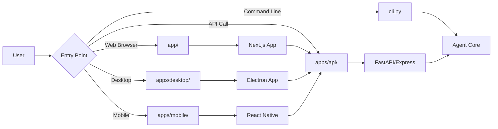
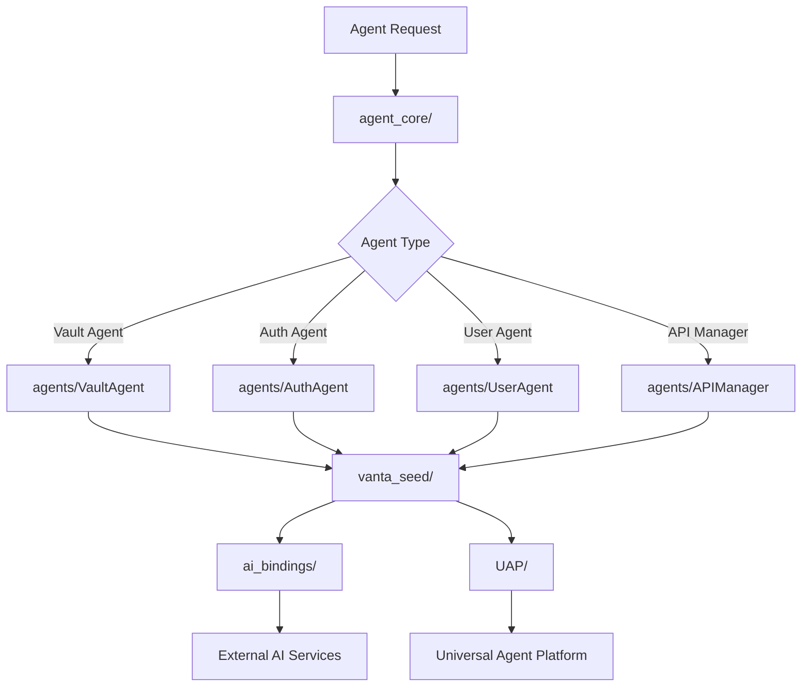
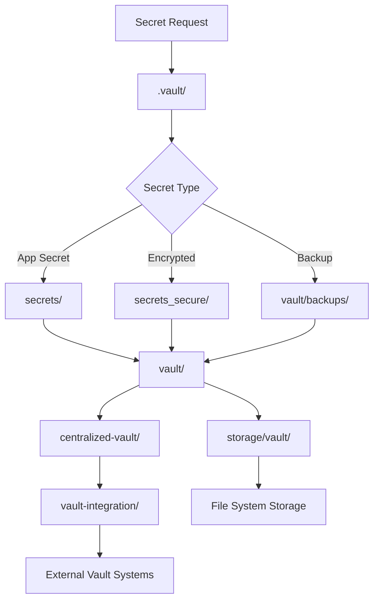
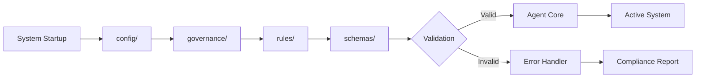
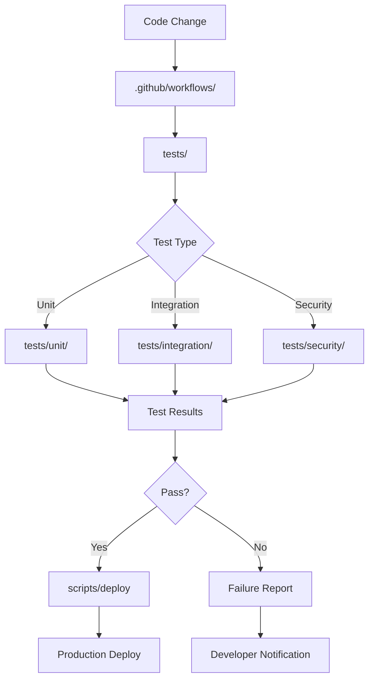
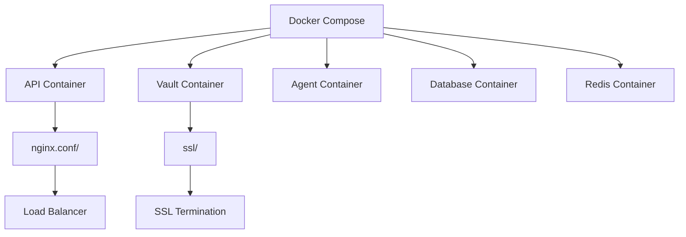

# Secrets Agent - Complete Project Structure & Workflow Analysis

## Project Overview
The Secrets Agent is a comprehensive secrets management platform with AI-driven automation, multi-platform support, and enterprise-grade security features. This analysis maps all 80+ root-level components and their interconnections.

## Root Folder Analysis by Category

### 🏗️ Application Core (Entry Points)
- **app/**: Next.js application with API routes and UI pages
- **apps/**: Multi-platform applications (ai-gateway, api, desktop, mobile)
- **src/**: Core TypeScript/Python source code with services and utilities

### 🤖 AI & Agent Systems
- **agent_core/**: Core agent framework and base classes
- **agents/**: Specialized agent implementations
- **ai_bindings/**: AI model integrations and bindings
- **vanta_seed/**: VANTA framework integration for agent orchestration
- **UAP/**: Universal Agent Platform components

### 🔐 Security & Vault Systems
- **.vault/**: Active vault configuration and secrets
- **vault/**: Vault implementation and backup systems
- **centralized-vault/**: Multi-node vault coordination
- **secrets/**: Secret definitions and templates
- **secrets_secure/**: Encrypted secret storage
- **vault-integration/**: External vault system integrations

### ⚙️ Configuration & Governance
- **config/**: System configuration files and templates
- **governance/**: Compliance rules and policies
- **rules/**: Business logic and validation rules
- **schemas/**: Data validation schemas

### 📚 Documentation & Templates
- **docs/**: Comprehensive documentation system
- **templates/**: Project and configuration templates
- **docs_site/**: Documentation website

### 🎨 UI & Frontend
- **components/**: Reusable UI components
- **secrets-agent-dashboard/**: Main dashboard application
- **assets/**: Static assets and prototypes

### 🔧 Development & Testing
- **.github/**: CI/CD workflows and automation
- **scripts/**: Build and deployment scripts
- **tests/**: Comprehensive test suite
- **__mocks__/**: Test mocks and fixtures

### 💾 Storage & Data
- **storage/**: File system storage
- **data/**: Static data and configurations
- **logs/**: Application and audit logs

### 🔌 Integration & Extensions
- **extension_api/**: VSCode and IDE extensions
- **hooks/**: Git hooks and automation
- **integration_hooks/**: External system integrations
- **services/**: External service integrations

### 🚀 Deployment & Infrastructure
- **nginx.conf/**: Web server configuration
- **ssl/**: SSL certificate management
- **Docker files**: Container configurations
- **installer/**: Installation scripts

## Comprehensive System Workflow

## Detailed Workflow Patterns

### 1. Application Entry Flow

### 2. Agent Orchestration Flow

### 3. Security & Vault Flow

### 4. Configuration & Governance Flow

### 5. Development & Testing Flow

## Data Flow Architecture

### Primary Data Paths
1. **User Input** → **API Layer** → **Agent Core** → **Vault System** → **Storage**
2. **Configuration** → **Governance** → **Rules Engine** → **Schema Validation** → **Agent Execution**
3. **External Integrations** → **Hooks** → **Services** → **Agent Processing** → **Response**

### Security Boundaries
- **Encrypted Transport**: All data flows through TLS/SSL
- **Agent Isolation**: Each agent runs in isolated context
- **Vault Segmentation**: Secrets isolated by project/environment
- **Audit Trail**: All operations logged to immutable logs

## Deployment Architecture

### Container Strategy

### Multi-Environment Support
- **Development**: Local containers with hot reload
- **Testing**: Isolated test environments with mock services
- **Staging**: Production-like environment for validation
- **Production**: High-availability multi-region deployment

## Key Integration Points

### External Systems
- **HashiCorp Vault**: Enterprise vault integration
- **AWS Secrets Manager**: Cloud secrets management
- **Azure Key Vault**: Microsoft cloud integration
- **Google Secret Manager**: GCP integration
- **VSCode Extension**: IDE integration via extension_api/

### AI/ML Platforms
- **OpenAI**: GPT model integration
- **Anthropic**: Claude model integration
- **Local Models**: Self-hosted AI models
- **Custom Agents**: Domain-specific agent implementations

## Monitoring & Observability

### Logging Strategy
- **Application Logs**: logs/app/
- **Security Logs**: logs/security/
- **Audit Logs**: logs/audit/
- **Performance Logs**: logs/performance/

### Metrics Collection
- **Agent Performance**: Response times, success rates
- **Vault Operations**: Access patterns, encryption metrics
- **System Health**: Resource usage, error rates
- **User Analytics**: Usage patterns, feature adoption

## Future Architecture Considerations

### Scalability
- **Horizontal Scaling**: Multiple agent instances
- **Vertical Scaling**: Enhanced compute resources
- **Geographic Distribution**: Multi-region deployment
- **Edge Computing**: Local processing nodes

### Advanced Features
- **Machine Learning**: Predictive secret rotation
- **Blockchain**: Immutable audit trails
- **Quantum Resistance**: Post-quantum cryptography
- **Zero-Trust**: Enhanced security model

---

This comprehensive workflow analysis provides a complete picture of the Secrets Agent architecture, showing how all 80+ components work together to create a sophisticated, secure, and scalable secrets management platform.