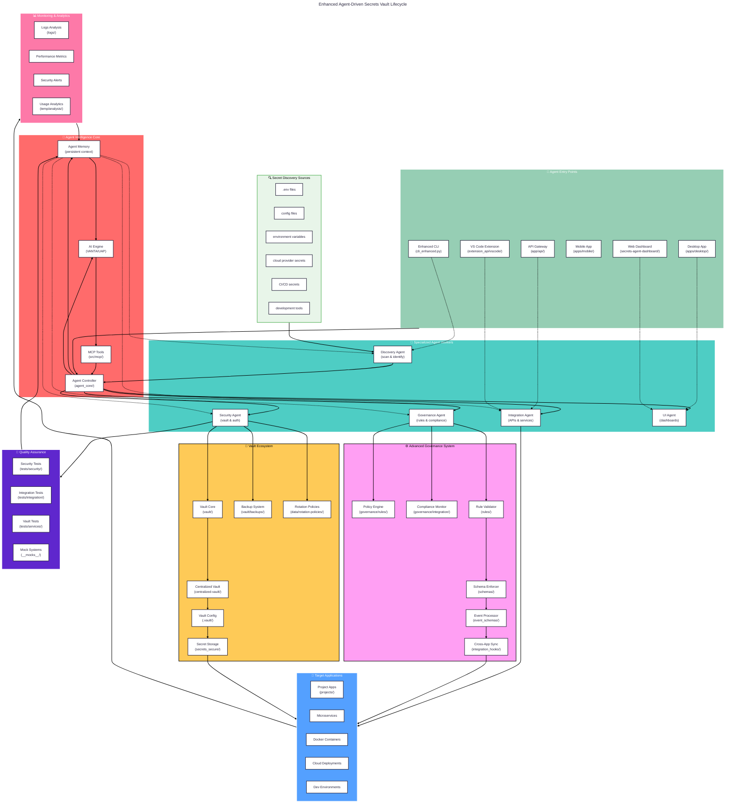
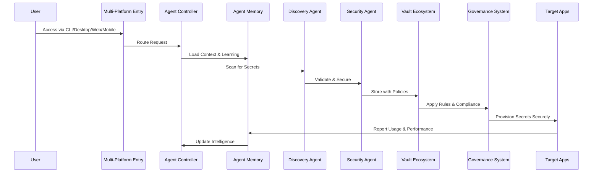

# Realistic Agent-Driven Secrets Vault Lifecycle

## Current State vs. Target Architecture

## 🔍 **What You're Missing vs. What You Need**

### **Current Gaps:**

| **Missing Component** | **What It Does** | **Where It Lives** |
|----------------------|------------------|-------------------|
| **Agent Memory System** | Persistent context across sessions | `agent_core/`, `vanta_seed/core/` |
| **MCP Tool Integration** | Model Context Protocol tools | `src/mcp/`, `app/api/mcp/` |
| **Multi-Platform Entry** | Desktop/Mobile/Web access | `apps/desktop/`, `apps/mobile/`, `secrets-agent-dashboard/` |
| **AI Engine Integration** | VANTA/UAP intelligence | `vanta_seed/`, `vanta_2_0/`, `UAP/` |
| **Advanced Vault Features** | Backup/Rotation/Policies | `vault/backups/`, `data/rotation-policies/` |
| **Testing Integration** | Security/Integration tests | `tests/security/`, `tests/integration/` |
| **Monitoring & Analytics** | Performance/Security monitoring | `logs/`, `temp/analysis/` |
| **Cross-Platform Sync** | Multi-app coordination | `integration_hooks/`, `services/` |

### **Enhanced Workflow Patterns:**

## 📋 **Your Development Roadmap**

### **Phase 1: Foundation (Current State)**
- ✅ Basic CLI agent
- ✅ Simple vault storage
- ✅ Basic governance

### **Phase 2: Intelligence Layer (Next Priority)**
- 🔲 Implement Agent Controller with routing
- 🔲 Add Agent Memory for persistent context
- 🔲 Integrate MCP tools for enhanced capabilities
- 🔲 Connect VANTA/UAP AI engines

### **Phase 3: Specialization (Medium Priority)**
- 🔲 Create specialized agent workers
- 🔲 Implement multi-platform entry points
- 🔲 Add advanced vault features (backup/rotation)
- 🔲 Enhance governance with real-time monitoring

### **Phase 4: Advanced Features (Future)**
- 🔲 Cross-platform synchronization
- 🔲 Advanced analytics and monitoring
- 🔲 Continuous learning and adaptation
- 🔲 Enterprise-grade security features

Your current chart shows **where you started**, but your codebase suggests you're building toward a **much more sophisticated agent-driven system**. The gap between your simple lifecycle and the actual architecture is substantial - you have the foundation for something much more powerful than your chart represents! 