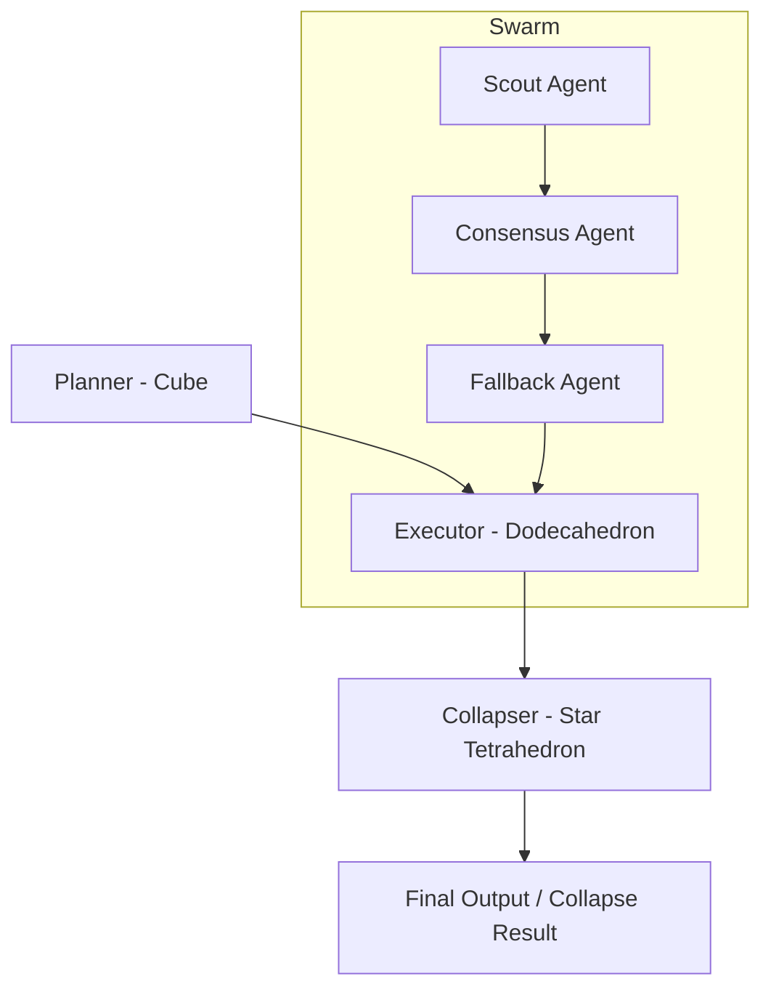

## Mermaid Diagram – UAP Agent Flow

```mermaid
graph TD
  U1[Planner - Cube] --> U2[Executor - Dodecahedron]
  U2 --> U3[Collapser - Star Tetrahedron]
  U3 --> U4[Final Output / Collapse Result]

  subgraph Swarm
    S1[Scout Agent]
    S2[Consensus Agent]
    S3[Fallback Agent]
    S1 --> S2 --> S3 --> U2
  end
```
