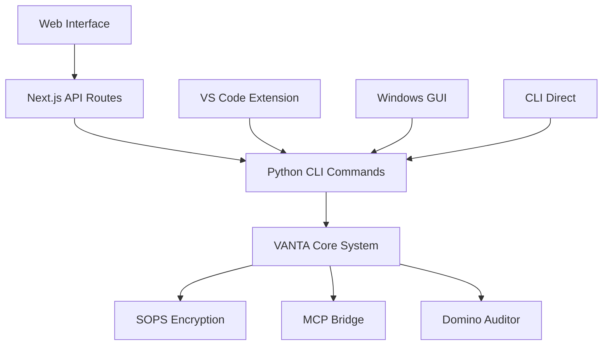

# 🔐 VANTA Secrets Agent - Unified Architecture

## 📋 **Executive Summary**

The VANTA Secrets Agent has been successfully unified into a comprehensive, cross-platform secrets management system that bridges the gap between the powerful Python-based backend and modern web interfaces.

## 🏗️ **Architecture Overview**

### **Core Components**

1. **VANTA Python Core** (`cli_enhanced.py`, `vanta_seed/`)
   - AI-powered secrets management
   - Cross-platform CLI interface
   - MCP (Master Control Program) integration
   - Domino Mode universal auditing
   - SOPS encryption integration

2. **Next.js Web Interface** (`app/`)
   - Modern React-based UI with Shadcn/UI components
   - Real-time integration with Python backend
   - Responsive design with Tailwind CSS
   - TypeScript for type safety

3. **API Bridge Layer** (`app/api/`)
   - RESTful endpoints connecting web UI to Python CLI
   - Real-time status monitoring
   - Async operation handling
   - Error handling and fallback mechanisms

## 🔧 **Key Features Implemented**

### **1. Unified Vault Management**
- **Real SOPS Integration**: Actual encryption/decryption using SOPS CLI
- **Vault Status Monitoring**: Live status of encryption, keys, and accessibility
- **Secret Management**: Add, rotate, and manage secrets through web interface
- **Cross-Platform Sync**: Consistent data across CLI, web, VS Code, and Windows GUI

### **2. MCP Bridge Integration**
- **Tool Discovery**: Dynamic loading of available MCP tools
- **Tool Execution**: Execute MCP tools through web interface
- **Status Monitoring**: Real-time MCP bridge connectivity status
- **Error Handling**: Graceful fallback when MCP services are unavailable

### **3. Domino Mode Universal Auditing**
- **Cross-Platform Audits**: Audit feature parity across web, CLI, VS Code, Windows
- **Governance Integration**: AI-powered governance decisions
- **Real-time Monitoring**: Track audit progress and results
- **Historical Data**: Audit history and trend analysis

### **4. Agent Status Monitoring**
- **Vault Agent**: Monitor vault operations and health
- **Rotation Agent**: Track secret rotation policies and schedules
- **MCP Bridge**: Monitor external tool connectivity
- **Real-time Updates**: Live status updates in web interface

## 🌐 **API Endpoints**

### **Vault Management**
```
GET  /api/vault/status          - Get vault status and agent health
GET  /api/vault/secrets         - List all vault secrets
POST /api/vault/secrets/add     - Add new secret
POST /api/vault/secrets/rotate  - Rotate existing secret
```

### **MCP Integration**
```
GET  /api/v1/mcp/tools          - List available MCP tools
POST /api/v1/mcp/execute        - Execute MCP tool
```

### **Domino Mode**
```
POST /api/v1/domino/audit/start - Start cross-platform audit
GET  /api/v1/domino/audit/{id}  - Get audit status
```

## 🎨 **UI Components**

### **Modern Design System**
- **Shadcn/UI Components**: Professional, accessible component library
- **Tailwind CSS**: Utility-first styling for consistent design
- **Lucide Icons**: Modern icon system
- **Responsive Layout**: Mobile-first design approach

### **Key Interface Elements**
- **Status Dashboard**: Real-time system health monitoring
- **Secret Management Table**: Sortable, filterable secret listing
- **MCP Tools Grid**: Visual tool discovery and execution
- **Audit Progress Tracker**: Real-time audit status and history

## 🔄 **Integration Flow**



## 🚀 **Getting Started**

### **1. Start the Development Server**
```bash
npm run dev
```

### **2. Access the Web Interface**
```
http://localhost:3002/vault
```

### **3. Test CLI Integration**
```bash
python cli_enhanced.py status
python cli_enhanced.py mcp list-tools
python cli_enhanced.py domino audit --project-path .
```

## 📊 **Current Status**

### **✅ Implemented Features**
- [x] Unified web interface with Shadcn/UI
- [x] Real SOPS vault integration
- [x] MCP tools discovery and execution
- [x] Domino mode audit initiation
- [x] Agent status monitoring
- [x] Cross-platform API bridge
- [x] Error handling and fallbacks
- [x] TypeScript type safety

### **🔄 In Progress**
- [ ] Real-time WebSocket updates
- [ ] Advanced secret rotation policies
- [ ] Backup and restore functionality
- [ ] User authentication integration

### **📋 Planned Features**
- [ ] Multi-tenant support
- [ ] Advanced governance workflows
- [ ] Integration with external secret managers
- [ ] Mobile application
- [ ] Advanced analytics dashboard

## 🛠️ **Technical Stack**

### **Frontend**
- **Next.js 14**: React framework with App Router
- **TypeScript**: Type-safe development
- **Shadcn/UI**: Modern component library
- **Tailwind CSS**: Utility-first styling
- **Lucide React**: Icon system

### **Backend Integration**
- **Python CLI**: Core VANTA functionality
- **SOPS**: Encryption and decryption
- **Node.js APIs**: Bridge layer
- **Child Process**: CLI command execution

### **Development Tools**
- **ESLint**: Code linting
- **Prettier**: Code formatting
- **Jest**: Testing framework
- **TypeScript**: Type checking

## 🔒 **Security Considerations**

### **Encryption**
- All secrets encrypted with SOPS using Age encryption
- Keys managed separately from encrypted data
- No plaintext secrets stored in web interface

### **API Security**
- Input validation on all endpoints
- Timeout protection for CLI commands
- Error message sanitization
- No sensitive data in logs

### **Access Control**
- CLI-based authentication model
- No direct database access from web
- All operations go through validated CLI commands

## 📈 **Performance Optimizations**

### **Caching**
- MCP tool discovery caching
- Vault status caching with TTL
- Static asset optimization

### **Async Operations**
- Non-blocking audit execution
- Background secret rotation
- Streaming status updates

### **Error Handling**
- Graceful degradation when CLI unavailable
- Fallback data for offline scenarios
- User-friendly error messages

## 🎯 **Next Steps**

1. **Enhanced Real-time Features**
   - WebSocket integration for live updates
   - Real-time audit progress tracking
   - Live secret rotation status

2. **Advanced Security**
   - Multi-factor authentication
   - Role-based access control
   - Audit logging and compliance

3. **Ecosystem Integration**
   - HashiCorp Vault integration
   - AWS Secrets Manager bridge
   - Azure Key Vault support

4. **Developer Experience**
   - API documentation with OpenAPI
   - SDK for external integrations
   - Plugin architecture for extensions

## 📞 **Support and Documentation**

- **CLI Help**: `python cli_enhanced.py --help`
- **API Documentation**: Available at `/api/docs` (planned)
- **Component Storybook**: Available at `/storybook` (planned)
- **GitHub Issues**: For bug reports and feature requests

---

**The VANTA Secrets Agent now provides a unified, professional-grade secrets management experience across all platforms while maintaining the security and flexibility of the original Python-based architecture.** 