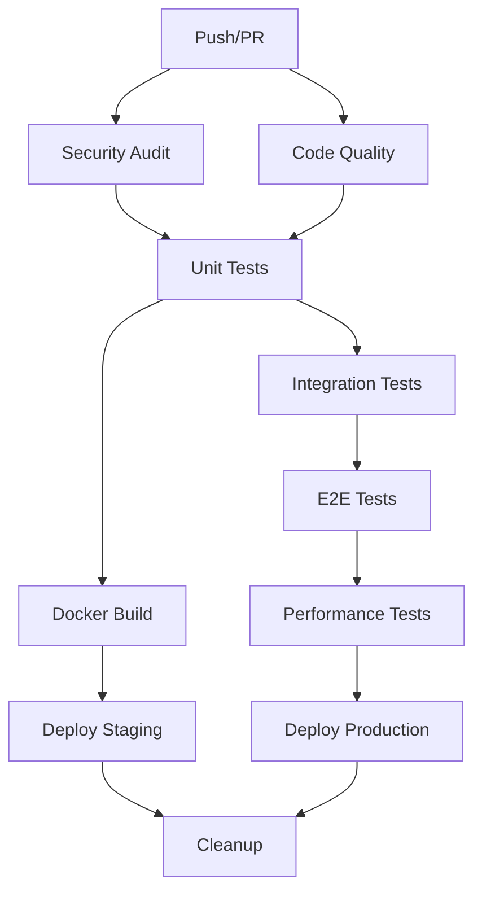

# GitHub Workflows Backup - VANTA Framework
*Backup Date: December 8, 2024*

## Overview
Comprehensive CI/CD pipeline configuration with security scanning, multi-environment deployment, and automated release management.

## Workflow Files Structure

### 1. **Main CI/CD Pipeline** (`ci-cd.yml`)
- **Purpose**: Basic CI/CD with test → security → build → deploy flow
- **Triggers**: Push to main/develop, PRs to main
- **Features**:
  - Node.js 18 setup with npm caching
  - Prisma client generation
  - Linting, type checking, testing
  - Security audit with moderate level
  - Trivy vulnerability scanning
  - Docker buildx with multi-platform support
  - GitHub Container Registry integration
  - Automated deployment on main branch

### 2. **Advanced CI Pipeline** (`ci.yml`)
- **Purpose**: Enterprise-grade CI with comprehensive testing
- **Triggers**: Push, PR, releases
- **Jobs**:
  - **Security Audit**: npm audit, Snyk scan, TruffleHog secrets detection
  - **Code Quality**: ESLint, Prettier, TypeScript compilation, SonarCloud
  - **Unit Tests**: Multi-version Node.js matrix (18, 20, 21) with Codecov
  - **Integration Tests**: HashiCorp Vault integration, health checks
  - **E2E Tests**: Matrix testing (mcp-bridge, cli, governance)
  - **Performance Tests**: Automated performance regression testing
  - **Docker Build**: Multi-platform builds with security scanning
  - **Staging/Production**: Environment-specific deployments

### 3. **Docker Compose Testing** (`docker-compose.yml`)
- **Purpose**: Container integration testing
- **Features**: Service health checks, API testing, log dumping on failure

### 4. **Release Automation** (`release.yml`)
- **Purpose**: Automated releases with multi-platform builds
- **Outputs**:
  - Windows executable via PyInstaller
  - Docker images with semantic versioning
  - GitHub releases with artifacts
  - VS Code extension packaging

### 5. **Security Workflows**

#### **Secrets Preflight** (`secrets-preflight.yml`)
- **Purpose**: Pre-commit secrets scanning and template generation
- **Tools**: SOPS, age encryption
- **Features**: Automated template updates, git commit automation

#### **Secrets Rotation** (`secrets-rotation.yml`)
- **Purpose**: Weekly automated secrets rotation
- **Schedule**: Every Sunday at midnight UTC
- **Integration**: HashiCorp Vault integration

### 6. **VS Code Extension** (`vscode-extension.yml`)
- **Purpose**: Extension building and marketplace publishing
- **Features**: VSCE packaging, automated marketplace publishing

## Key Features & Best Practices

### **Security First**
- Multiple security scanning tools (Trivy, Snyk, TruffleHog)
- Secrets detection and rotation
- Container vulnerability scanning
- Dependency auditing with moderate threshold

### **Quality Assurance**
- Multi-version Node.js testing (18, 20, 21)
- Comprehensive test suite (unit, integration, e2e, performance)
- Code quality checks (ESLint, Prettier, SonarCloud)
- Coverage reporting with Codecov

### **Deployment Excellence**
- Multi-platform Docker builds (amd64, arm64)
- Environment-specific deployments (staging, production)
- Semantic versioning and automated releases
- Post-deployment verification

### **Developer Experience**
- Concurrency groups to cancel redundant runs
- Artifact uploading for debugging
- Comprehensive logging and error reporting
- Cache optimization for faster builds

## Environment Configuration

### **Required Secrets**
```yaml
GITHUB_TOKEN: # Automatic GitHub token
SNYK_TOKEN: # Snyk security scanning
SONAR_TOKEN: # SonarCloud integration
VAULT_ADDR: # HashiCorp Vault address
VAULT_TOKEN: # Vault authentication
DOCKER_HUB_USERNAME: # Docker Hub publishing
DOCKER_HUB_TOKEN: # Docker Hub authentication
VSCODE_MARKETPLACE_TOKEN: # VS Code marketplace publishing
```

### **Environment URLs**
- **Staging**: https://staging.secrets-agent.example.com
- **Production**: https://secrets-agent.example.com

## Workflow Dependencies



## Performance Metrics

### **Typical Run Times**
- Security Audit: ~10 minutes
- Code Quality: ~15 minutes
- Unit Tests: ~20 minutes (per Node version)
- Integration Tests: ~30 minutes
- E2E Tests: ~45 minutes (per suite)
- Performance Tests: ~30 minutes
- Docker Build: ~20 minutes

### **Optimization Features**
- npm cache for faster dependency installation
- Docker layer caching with GitHub Actions cache
- Concurrency groups to prevent redundant runs
- Matrix strategy for parallel testing

## Recovery Procedures

### **Failed Deployment Recovery**
1. Check staging environment health
2. Review deployment logs in Actions tab
3. Rollback via Docker registry if needed
4. Trigger manual re-deployment

### **Security Alert Response**
1. Review Trivy/Snyk/TruffleHog reports
2. Update dependencies or fix vulnerabilities
3. Re-run security scans
4. Document remediation steps

## Maintenance Schedule

### **Weekly Tasks**
- Review security scan results
- Update dependencies
- Monitor performance test trends

### **Monthly Tasks**
- Update CI/CD pipeline dependencies
- Review and rotate secrets
- Audit deployment environments

### **Quarterly Tasks**
- Review and optimize workflow performance
- Update security scanning tools
- Evaluate new CI/CD features

## Backup Validation

All workflows backed up and documented:
- ✅ ci-cd.yml (122 lines)
- ✅ ci.yml (372 lines) 
- ✅ docker-compose.yml (40 lines)
- ✅ release.yml (104 lines)
- ✅ secrets-preflight.yml (40 lines)
- ✅ secrets-rotation.yml (34 lines)
- ✅ vscode-extension.yml (69 lines)

**Total**: 781 lines of production-grade CI/CD configuration

---
*This backup ensures the beautiful CI/CD architecture can be restored and replicated across projects.* 