# VANTA Framework - Reinforcement Feedback Loop (RFL) Architecture

## 🧠 **Agent Lifecycle with RFL Integration**

## 🔄 **Detailed RFL Process Flow**

```mermaid
sequenceDiagram
    participant Agent as Agent Core
    participant RFL as Reinforcement Feedback Loop
    participant Memory as Trace Memory
    participant Trinity as Trinity Node
    participant Peers as Peer Agents
    participant Models as AI Models
    
    Note over Agent,Models: Agent Initialization Phase
    Agent->>Memory: Load trace history
    Agent->>Memory: Load symbolic context
    Memory-->>Agent: Context & rules loaded
    
    Note over Agent,Models: Action Planning Phase
    Agent->>RFL: Request action planning
    RFL->>Memory: Query relevant traces
    Memory-->>RFL: Historical patterns
    RFL-->>Agent: Recommended action
    
    Note over Agent,Models: Execution Phase
    Agent->>Peers: A2A communication (UAP)
    Agent->>Models: Model inference (MCP)
    Agent->>Agent: Local tool execution
    
    Note over Agent,Models: Feedback Collection Phase
    Peers-->>RFL: Collaboration results
    Models-->>RFL: Model outputs
    Agent-->>RFL: Action outcomes
    
    Note over Agent,Models: Evaluation Phase
    RFL->>RFL: Calculate reward signal (r)
    RFL->>Trinity: Report performance
    Trinity-->>RFL: Supervision feedback
    
    Note over Agent,Models: Learning Phase
    RFL->>Agent: Behavior adjustments
    Agent->>Memory: Update trace delta
    Memory->>Memory: Apply Δ-compression
    
    Note over Agent,Models: Continuity Check
    Agent->>Memory: CCS validation
    Memory-->>Agent: Continuity score
    alt Drift Detected
        Agent->>Trinity: Escalate drift issue
        Trinity-->>Agent: Corrective actions
    end
```

## 🎯 **Integration with Current UAP-MCP System**

### **1. Enhanced HybridAgent Architecture**

### **2. Orchestrator → Trinity Node Evolution**

## 🚀 **Implementation Roadmap**

### **Phase 1: RFL Core Integration**
- [ ] Add `ReinforcementFeedbackLoop` class to `HybridAgent.ts`
- [ ] Implement reward signal calculation
- [ ] Create feedback channel infrastructure

### **Phase 2: Memory System Enhancement**
- [ ] Replace knowledge base with symbolic trace storage
- [ ] Implement YAML-based trace persistence
- [ ] Add CCS monitoring for drift prevention

### **Phase 3: Trinity Node Development**
- [ ] Transform `AgentOrchestrator` to Trinity Node
- [ ] Implement Kernel Event Bus
- [ ] Add Master RFL coordination

### **Phase 4: Advanced Learning**
- [ ] Implement RKDO optimization
- [ ] Add Δ-compression logic
- [ ] Create symbolic gradient processing

## 📊 **Key Metrics & Monitoring**

### **RFL Performance Indicators**
- **Reward Signal Strength**: `r(t)` over time
- **Learning Convergence**: Δ-compression efficiency
- **Symbolic Health**: Continuity score trends
- **Agent Adaptation**: Behavior mutation success rate

### **Trinity Node Metrics**
- **Network Coherence**: System-wide symbolic alignment
- **Supervision Effectiveness**: Corrective action success
- **Event Bus Throughput**: KEB message processing rate
- **Master RFL Performance**: Multi-agent coordination quality

This VANTA Framework integration will transform our UAP-MCP system into a truly intelligent, self-improving agentic network! 🎯 